# Uzupełnienie materiałów do Lab 4
## Ten materiał jest dla Ciebie, jeżeli masz zaległości w projekcie eksperymentalnym "Biblioteka", który wykonujemy wspólnie na zajęciach
### W tym pliku podam krok po kroku, jak od początku wykonac lab po labie, aby być na tym samym etapie na następnym zajęciach wykonując laboratorium nr 4.
### Na początku był chaos, a z chaosu wyłoniło się...
## 1. Puste repozytorium zdalne na Github:

Jeżeli jeszcze tego nie zrobił_ś to to jest czas najwyższy, aby założyć konto na serwisie github: https://github.com/ . Zapamiętajmy nazwę użytkownika oraz użyty mail ( nie ma potrzeby, aby był to uczelniany ).

Gdy mamy już konto musimy kliknąć w prawym górnym rogu na ikonę swojego awatara (numer 1. na **_screenshocie 1_**). Następnie wybrać Wszystkie nasze repozytoria (numer 2. na **_screenshocie 1_**).

**_Screenshot 1_**
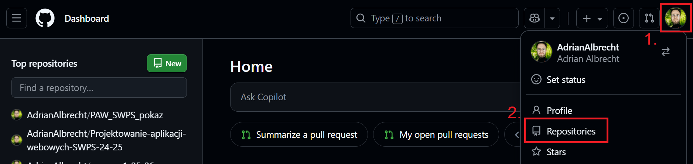

Następnie klikamy zielony przycisk `New`, aby utworzyć nowe repozytorium (**_screenchot 2_**):

**_Screenshot 2_**
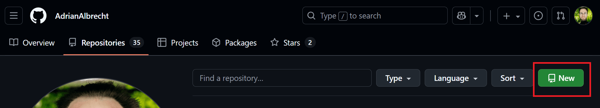

Następnie powinien otworzyć nam się formularz tworzenia nowego repozytorium, w którym uzupełniamy nazwę repozytorium, na jakieś nam odpowiadające (1. na **_screenshocie 3_**). Resztę ustawień zostawiamy domyślnych tak jak na screenshocie. Zatwierdzamy zielonym przyciskiem `Create repository` (2. na **_screenshocie 3_**).

**_Screenshot 3_**
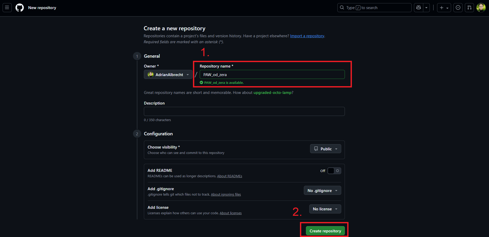

Mamy stworzone repozytorium zdalne! Ale **nie zamykaj jeszcze tej strony** - będzie nam potrzebna później. Teraz pora stworzyć repozytorium lokalne, w którym zawierać się będzie nasz projekt!

## (Opcjonalnie) Instalacja VS Code, git i python na twoim komputerze

Jeżeli jeszcze tego nie zrobiłeś zainstaluj na swoim komputerze:

- git (https://git-scm.com/downloads),
- VS Code (https://code.visualstudio.com/download),
- python w wersji minimum 3.9 (np. przez Microsoft Store: https://apps.microsoft.com/detail/9PNRBTZXMB4Z?hl=neutral&gl=PL&ocid=pdpshare)

Po zainstalowaniu wszystkiego warto sprawdzić w terminalu/ wierszu poleceń (cmd):
- wersję pythona
```bash
python --version
```
>!!! UWAGA!!!
   Czasami, polecenie *python --version* nie pokaże nam tej wersji, którą chcemy bądź pokaże nam informacje o braku pythona pomimo instalacji. Spróbuj wtedy polecenia:
    >```bash
    > python3 --version
    >```
    >Jeżeli to zadziała, **zapamiętaj to**, ponieważ przez resztę zajęć jeżeli będziesz używać komendy *python* użyj zamiast tego *python3*!!!
- wersję pip (menadżera pakietów python)
 ```bash
   pip --version
   ```
 >!!! UWAGA!!!
 Adekwatnie do *python*, jeżeli musisz używac *python3* zamiast *pip* użyj *pip3*.


## 2. Nowy projekt w VS Code i inicjalizacja repozytorium lokalnego:

Tworzymy nowy folder w naszym folderze roboczym (gdzieś na komputerze, gdzie wiemy, że te pliki nie zostaną usunięte i będziemy mogli je znaleźć). Następnie otwieramy ten folder w naszym Visual Studio Code (**_screenshot 4_** i **_screenshot 5_**).

**_Screenshot 4_**

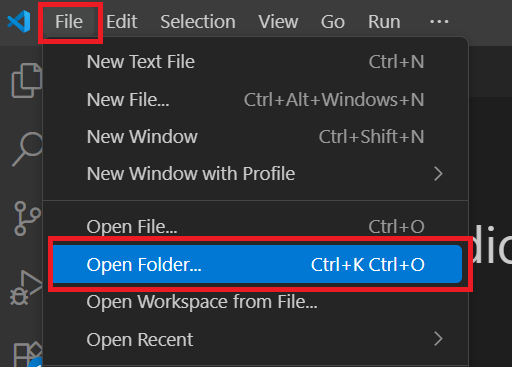

**_Screenshot 5_**

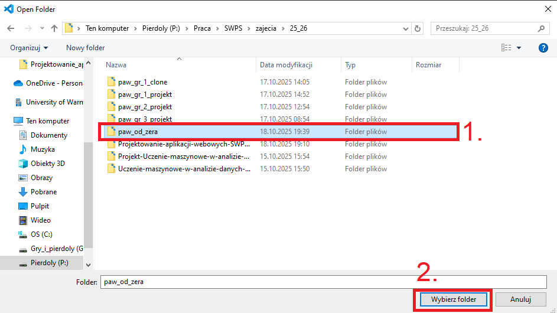

Teraz gdy już mamy uruchomiony nowy projekt w VS Code, możemy uruchomić terminal (**_screenshot 6_**), ewentualnie zmienić na `command prompt` (lub `zsh` na Macu) (**_screenshot 7_**) i zacząć wpisywać komendy konfiguracyjne naszego projektu.

**_Screenshot 6_**

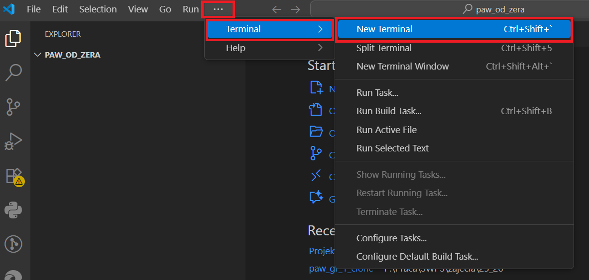

**_Screenshot 7_**

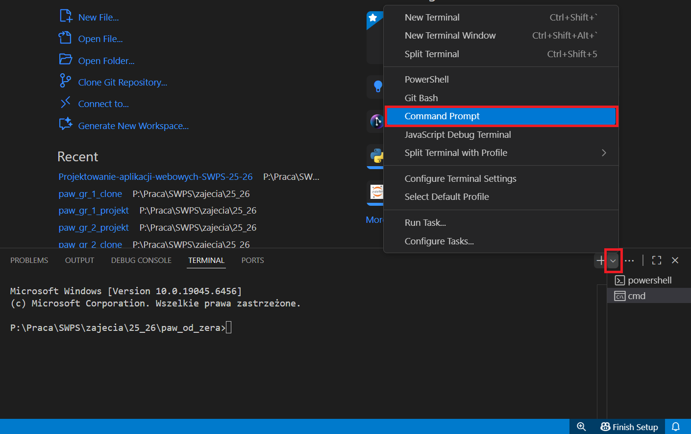

Ale co my mamy zacząć tu wpisywać? A no pamiętasz jak nie kazałem zamykać tej strony, która wyskoczyła po utworzeniu zdalnego repozytorium? To one będę nam potrzebne (**_screenshot 8_**).

**_Screenshot 8_**

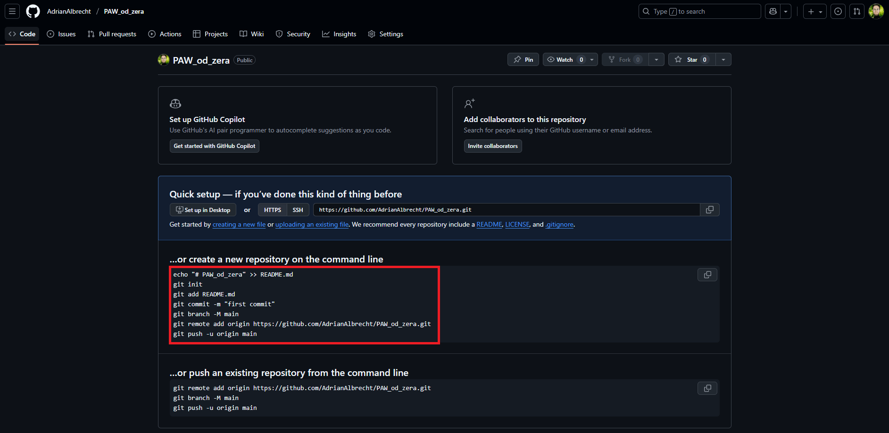

Przykładowo te polecenia mogą wyglądąć następująco:

```bash
echo "# PAW_od_zera" >> README.md
git init
git add README.md
git commit -m "first commit"
git branch -M main
git remote add origin https://github.com/AdrianAlbrecht/PAW_od_zera.git
git push -u origin main
```

Ale nie wszystkie są dokładnie takie jakie chcemy, a niektórych potrzebnych nam nie ma. Możemy je więc częściowo ukrócić, a częściowo dodać parę komend. Ostateczna wersja będzie wyglądać następująco:

```bash
echo "# Projektowanie Aplikacji Webowych 2025/26" >> README.md
echo "Twoje imię i nazwisko" >> README.md
git init
git config --local user.name akowalski
git config --local user.email akowalski@gmail.com
git add README.md
git commit -m "first commit"
git branch -M main
git remote add origin https://github.com/AdrianAlbrecht/PAW_od_zera.git
git push -u origin main
```

Oczywiście dane te wpisujemy od otworzonego terminala w poprzednim kroku.

> ### UWAGA!!! PODANE LINKI, DANE I INNE SĄ PRZYKŁADOWE! OCZYWISTE JEST, ABY LINKI DO REPOZYTORIUM, DANE TAKIE JAK NAZWA UŻYTKOWNIKA CZY MAIL NALEŻY ZAMIENIĆ NA SWOJE, A NIE UŻYWAĆ MOICH!!!!

> Jeżeli wyskakuje Ci error, spróbuj zrobić commit and push w warstwie graficznej, tak jak na zajęciach.

## 3. Utworzenie pliku .gitignore i dodanie go do repozytorium zdalnego

Tworzymy nowy plik, który nazywamy `.gitignore` (**_screenshot 9_**), a w jego zawartość wpisujemy:

```text
venv
__pycache__
```

**_Screenshot 9_**

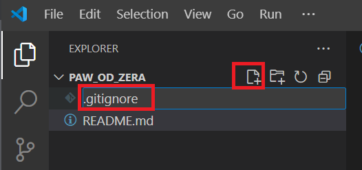

Zapisujemy plik ( skrót klawiszowy _CTRL + S_ , lub aby włączyć autozapis, co może być przydatne w VSC: _File/Auto Save _). Następnie wpisujemy w terminal:

```bash
git add .
git commit -m "Added .gitignore"
git push
```

## 4. Tworzenie i aktywacja wirtualnego środowiska:

Aby utworzyć środowisko wirtualne w python wpisujemy w terminal:

> ### Pamiętajmy, jeżeli wcześniej działał nam `python3` zamiast `python` to również w każdych kolejnych poleceniach zamieniamy `python` na `python3`!!!!

```bash
python -m venv venv
```

Następnie, aby aktywować to środowisko:
- Na Windows:
```bash
venv\\Scripts\\activate
```
- Na macOS/Linux:
```bash
source venv/bin/activate
```

Skąd wiem, że mamy aktywne to środowisko? Informacja ta widnieje przed aktywną ścieżką w terminalu (**_screenchot 10_**).

**_Screenshot 10_**

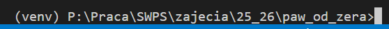

## 5. Instalacja django oraz tworzenie pustego projektu django wraz z nową aplikacją

Kontynuujemy prace w terminalu wpisując kolejno komendy:
1. **Zainstaluj Django**:
    ```bash
    pip install django
    ```
2. **Stwórz nowy projekt Django**:
- W terminalu, upewnij się, że jesteś w katalogu głównym swojego projektu. Następnie użyj polecenia:
    ```bash
    django-admin startproject paw_od_zera_project
    ```
    zamieniając `paw_od_zera_project` na nazwę swojego projektu (preferowana nazwa tak jak na zajęciach - `gr_[nr_grupy]_project`, czyli jeśli jesteś z _grupy 1_ wpisujesz `gr_1_project`)
- Przejdź do folderu projektu (zamieniając `paw_od_zera_project` na nazwę swojego projektu):
    ```bash
    cd paw_od_zera_project
    ```
3. **Stwórz aplikację Django**:
- W folderze projektu utwórz nową aplikację:
    ```bash
    python manage.py startapp biblioteka
    ```
4. **Uruchom wbudowany serwer**:
- Aby uruchomić serwer, użyj polecenia:
    ```bash
    python manage.py runserver
    ```
- Sprawdź, czy aplikacja działa, otwierając przeglądarkę i wpisując adres `http://127.0.0.1:8000/`. Powinien wyświetlić się na przeglądarce ekran jak na **_screenshot 11_**.

**_Screenshot 11_**

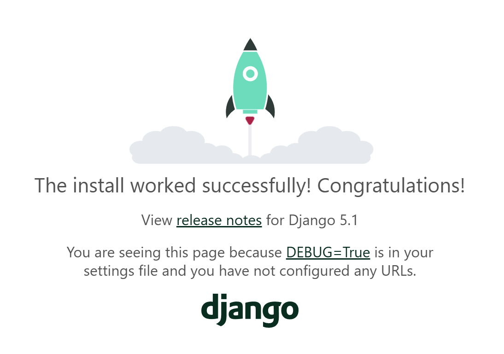

## 6. Konfiguracja bazy danych i superużytkownika:

Aby kontynuować pracę, wrócmy do Visual Studio Code, kliknijmy w terminal i naciśnijmy _CTRL + C_, aby zatrzymać pracę serwera i móc dalej działać w terminalu. 

Wpisujemy teraz w terminal:

```bash
python manage.py migrate
```

Następnie warto doinstalować rozszerzenie do Visual Studio Code do przeglądania plików bazy danych SQLite3 - `SQLite Viewer` (**_screenshot 12_**).

**_Screenshot 12_**

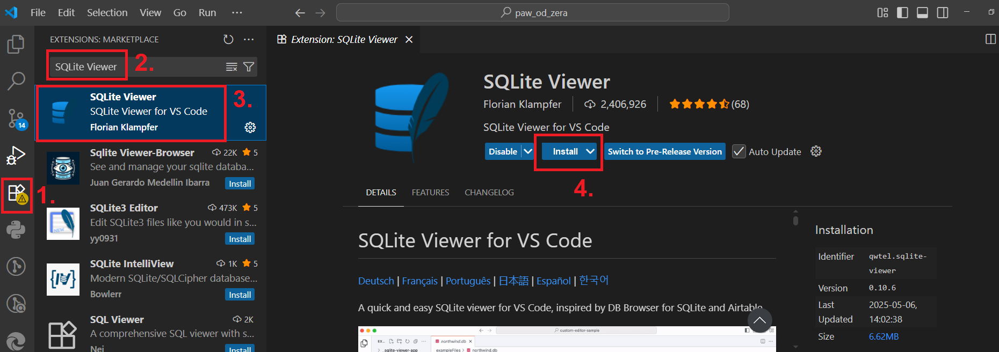

Teraz możemy utworzyć nowego superużytkownika wpisując poniższą komendę w terminal, a następnie uzupełniając dane (**_screenshot 13_**) wpisując kolejno `nazwę` superużytkonwika (ja używam _admin_), `email` (nie musi istnieć, ja wpisuję _mail@example.com_) oraz jego `hasło` (ja używam _zaq1@WSX_). Warto zapamiętać te dane, a przynajmniej nazwę i hasło.

> ### UWAGA! Podczas wpisywania hasła nie będzie się wyświetlać co Państwo wpisują! To nie błąd, tak ma być, niech mi Państwo uwierzą, ze się wpisuje :)

```bash
python manage.py createsuperuser
```

**_Screenshot 12_**

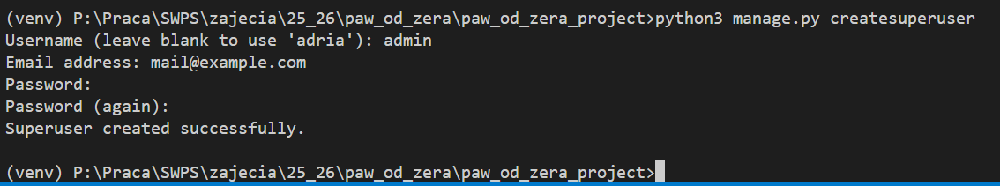

## 7. Dodanie modeli do aplikacji, projektu i panelu administratora:

Odszukajmy plik `models.py` w folderze `paw_od_zera_project/biblioteka` (**_screenshot 13_**):

**_Screenshot 13_**

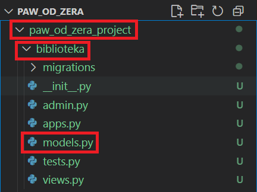

i dodajemy do niego zawartość:

```python
# Lista wyboru miesięcy wydania
MONTHS = models.IntegerChoices(
    'Miesiace',
    'Styczeń Luty Marzec Kwiecień Maj Czerwiec Lipiec Sierpień Wrzesień Październik Listopad Grudzień'
)

# Lista wyboru formatu książki
BOOK_FORMATS = (
    ('P', 'Papierowa'),
    ('E', 'E-book'),
    ('A', 'Audiobook'),
)


class Genre(models.Model):
    """Model reprezentujący gatunek literacki."""
    name = models.CharField(max_length=50)
    description = models.TextField(blank=True, help_text="Krótki opis gatunku literackiego.")
    typical_themes = models.CharField(
        max_length=200,
        blank=True,
        help_text="Typowe motywy i tematy występujące w tym gatunku."
    )
    is_fiction = models.BooleanField(default=True, help_text="Czy gatunek jest fikcyjny (literatura piękna).")
    popularity_rank = models.PositiveSmallIntegerField(
        default=0,
        help_text="Ocena popularności (0–10) według bibliotekarzy lub czytelników."
    )

    def __str__(self):
        return self.name


class Author(models.Model):
    """Model reprezentujący autora książki."""
    first_name = models.CharField(max_length=50)
    last_name = models.CharField(max_length=50)
    country = models.CharField(max_length=2, help_text="Kod kraju, np. PL, US, GB")

    def __str__(self):
        return f"{self.first_name} {self.last_name}"


class Book(models.Model):
    """Model reprezentujący książkę w bibliotece."""
    title = models.CharField(max_length=100)
    publication_month = models.IntegerField(choices=MONTHS.choices, default=MONTHS.Styczeń)
    book_format = models.CharField(max_length=1, choices=BOOK_FORMATS, default='P')
    author = models.ForeignKey(Author, null=True, blank=True, on_delete=models.SET_NULL)
    genre = models.ForeignKey(Genre, null=True, blank=True, on_delete=models.SET_NULL)
    available_copies = models.PositiveIntegerField(default=1)

    def __str__(self):
        return self.title
```

tak, aby całość pliku miała **_TYLKO_** taką zawartość:

```python
from django.db import models

# Lista wyboru miesięcy wydania
MONTHS = models.IntegerChoices(
    'Miesiace',
    'Styczeń Luty Marzec Kwiecień Maj Czerwiec Lipiec Sierpień Wrzesień Październik Listopad Grudzień'
)

# Lista wyboru formatu książki
BOOK_FORMATS = (
    ('P', 'Papierowa'),
    ('E', 'E-book'),
    ('A', 'Audiobook'),
)


class Genre(models.Model):
    """Model reprezentujący gatunek literacki."""
    name = models.CharField(max_length=50)
    description = models.TextField(blank=True, help_text="Krótki opis gatunku literackiego.")
    typical_themes = models.CharField(
        max_length=200,
        blank=True,
        help_text="Typowe motywy i tematy występujące w tym gatunku."
    )
    is_fiction = models.BooleanField(default=True, help_text="Czy gatunek jest fikcyjny (literatura piękna).")
    popularity_rank = models.PositiveSmallIntegerField(
        default=0,
        help_text="Ocena popularności (0–10) według bibliotekarzy lub czytelników."
    )

    def __str__(self):
        return self.name


class Author(models.Model):
    """Model reprezentujący autora książki."""
    first_name = models.CharField(max_length=50)
    last_name = models.CharField(max_length=50)
    country = models.CharField(max_length=2, help_text="Kod kraju, np. PL, US, GB")

    def __str__(self):
        return f"{self.first_name} {self.last_name}"


class Book(models.Model):
    """Model reprezentujący książkę w bibliotece."""
    title = models.CharField(max_length=100)
    publication_month = models.IntegerField(choices=MONTHS.choices, default=MONTHS.Styczeń)
    book_format = models.CharField(max_length=1, choices=BOOK_FORMATS, default='P')
    author = models.ForeignKey(Author, null=True, blank=True, on_delete=models.SET_NULL)
    genre = models.ForeignKey(Genre, null=True, blank=True, on_delete=models.SET_NULL)
    available_copies = models.PositiveIntegerField(default=1)

    def __str__(self):
        return self.title
```

Po zdefiniowaniu modelu należy dodać nasza aplikację do zmiennej `INSTALLED_APPS` w pliku `settings.py`. Plik `settings.py` znajduje się w folderze `paw_od_zera_project/paw_od_zera_project` (**_screenshot 14_**). Zmienna `INSTALLED_APPS` natomiast w około 33 lini kodu pliku `settings.py`(**_screenshot 15_**).

**_Screenshot 14_**


**_Screenshot 15_**


Tam modyfikujemy naszą zmienną `INSTALLED_APPS`, aby wyglądała w następujący sposób (czyli dodajemy do tej zmiennej, która jest listą pythonową element `'biblioteka.apps.BibliotekaConfig',` na początku):

```python
INSTALLED_APPS = [
    'biblioteka.apps.BibliotekaConfig',
    'django.contrib.admin',
    'django.contrib.auth',
    'django.contrib.contenttypes',
    'django.contrib.sessions',
    'django.contrib.messages',
    'django.contrib.staticfiles',
]
```

Następnie przygotowujemy migracje dodanych modeli w naszej aplikacji `Biblioteka` i uruchamiamy te migracje poleceniami w aktywnym terminalu:

```bash
python manage.py makemigrations
python manage.py migrate
```

Teraz ostatnią rzeczą będzie odszukać plik `admin.py` w folderze `paw_od_zera_project/biblioteka` (**_screenshot 16_**) i dodać do niego następującą zawartość:

```python
from .models import Genre, Author, Book

admin.site.register(Genre)
admin.site.register(Author)
admin.site.register(Book)
```

**_Screenshot 16_**

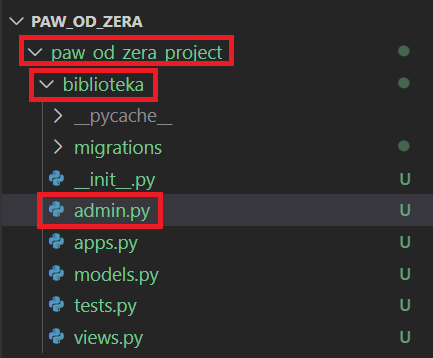

w taki sposób, aby całość pliku `admin.py` wyglądała następujaco:

```python
from django.contrib import admin

from .models import Genre, Author, Book

admin.site.register(Genre)
admin.site.register(Author)
admin.site.register(Book)
```

## 8. Finalne zatwierdzenie zmian i wypchnięcie do repozytorium zdalnego:

Wpisujemy w terminal:

```bash
git add .
git commit -m "Done to lab 3"
git push
```

... i gotowe!!!!

#### Gratulacje! Mamy na czym pracować na następnym labkach!

Pozostaje pytanie jak to później ściagnąć w sali?

1. Tworzymy nowy folder w przestrzeni roboczej (tam gdzie na pewno nikt nam nie usunie go).
2. Uruchamiamy VSC normalnie na komputerze w sali.
3. Klikamy _File/Close Folder_.
4. Utworzymy nowy projekt w VSC i sklonujemy zdalne repozytorium (**_screenshot 17_**) używając linku do repozytorium (**_screenshot 18_** i **_screenshot 19_**).

**_Screenshot 17_**


**_Screenshot 18_**

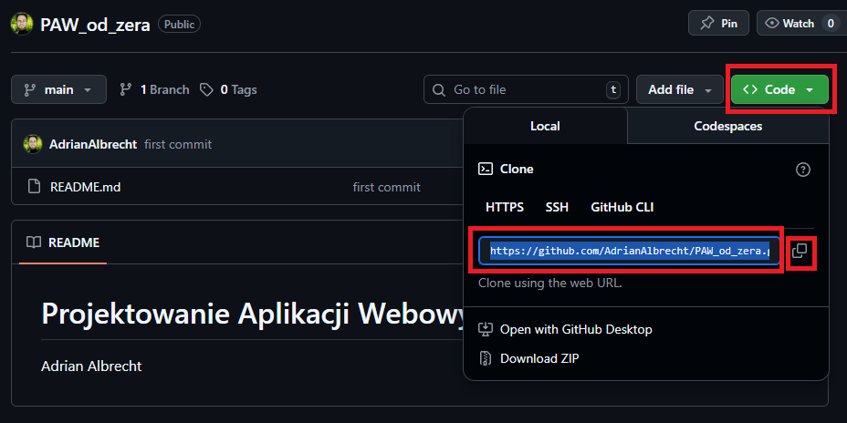

**_Screenshot 19_**

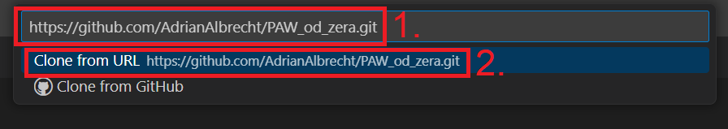

### GOTOWE!
#### Do zobaczenia na następnych zajęciach!

---

W razie problemów prosze śmiało pisać na maila: [aalbrecht@swps.edu.pl](mailto:aalbrecht@swps.edu.pl)
