# Projektowanie Aplikacji Webowych, semestr 2025Z

## Lab 8 - Definiowanie widoków w aplikacji Django. Proste szablony stron.
---
### **1. Definiowanie widoków w aplikacji Django.**

> Dokumentacja dla widoków w Django: https://docs.djangoproject.com/pl/4.2/topics/http/views/


Widokiem nazywamy kawałek kodu, który odpowiada za przetworzenie konkretnego obiektu `żądania` i zwrócenie obiektu `odpowiedzi`. We frameworku Django w podstawowej jego odsłonie (można korzystać z rozszerzających go modułów, np. Django Rest Framework) będą to odpowiednio obiekty `HttpRequest` oraz `HttpResponse`. Obiekt żądania będzie zawierał adres URL (Uniform Resource Locator, zobacz: https://pl.wikipedia.org/wiki/Uniform_Resource_Locator), który będzie wskazywał w sposób jednoznaczny dla danego hosta gdzie żądane zasoby się znajdują (lub zwróci np. błąd 404, jeżeli takich zasobów na tym hoście nie zdefiniowano) oraz może zawierać również dodatkowe parametry nazywane parametrami żądania. Protokół HTTP definiuje wiele typów żądań np. `GET`,`POST`, `PUT`, `PATCH`, `DELETE` i inne. 

Zacznijmy od prostego widoku, tak aby zobaczyć jaką "drogę" pokonuje żądanie i w jaki sposób w Django określamy definicję widoku i adresu URL, który będzie uruchamiał logikę generowania tego widoku.

_**Listing 1**_

```python
# kod umieszczamy w pliku views.py wybranej aplikacji

from django.http import HttpResponse
import datetime


def welcome_view(request):
    now = datetime.datetime.now()
    html = f"""
        <html><body>
        Witaj użytkowniku! </br>
        Aktualna data i czas na serwerze: {now}.
        </body></html>"""
    return HttpResponse(html)
```

W powyższej funkcji, którą nazywamy tutaj również widokiem, obiektem, z który otrzymamy do obsługi jest obiekt `django.http.HttpRequest` czyli obiekt żądania, a zwracać (return) będziemy obiekt typu `django.http.HttpResponse`. Do zmiennej `now` zapisujemy bieżącą datę i czas i podstawiamy ją w naszym prostym szablonie strony w miejscu znacznika `{now}`, a następnie zmienną `html` przekazujemy jako argument do obiektu `HttpResponse`, który zostanie wysłany jako odpowiedź serwera do przeglądarki, z której to żądanie zostało wysłane. To nie musi być HTML, możemy tu przekazać sam tekst, obraz czy inny plik.

**Mamy definicję widoku, ale w jaki sposób w przeglądarce wskazać adres URL, który ten widok wywoła?**

Aby lepiej zrozumieć cały cykl prześledźmy go na poniższym schemacie:


źródło: https://medium.com/@praseeshprasee/django-request-response-cycle-explained-e3d707eed99c

Patrząc na schemat i kolejne kroki żądania od klienta (u nas przeglądarka www), żądanie trafia do serwera (u nas po uruchomieniu polecenia `python manage.py runserver` zostaje on uruchomiony na komputerze lokalnym, stąd adresy http://localhost lub http://127.0.0.1, które to adresy odpowiadają lokalnej maszynie), następnie żądanie (`REQUEST`) przekierowane jest do etapu `URL RESOLUTION` (plik urls.py), w którym póki co nie umieszczaliśmy jeszcze żadnego kodu. I to jest miejsce, w którym we frameworku Django zdefiniujemy reguły, które skierują żądania dla danego adresu URL do widoku, który stworzyliśmy w listingu 1. Okazuje się bowiem, że ze schematu wynika, że pozostałe części (views.py, `RESPONSE` i powrót do przeglądarki) już zdefiniowane są, więc brakuje zmapowania URL na widok.

Można zdefiniować wszystkie mapowania URL w głównym pliku `urls.py` (`gr_X_project\urls.py`), ale biorąc pod uwagę modułową naturę projektu Django oraz możliwość rozrośnięcia się projektu do większych ilości widoków, takie podejście nie jest najlepszym rozwiązaniem. Tutaj mapowania URL na widoki będziemy wykonywać w plikach wewnątrz konkretnej aplikacji.

**Stwórzmy więc *(o ile już nie istnieje)* plik `gr_X_project\biblioteka\urls.py`.**

Edytujemy plik `biblioteka\urls.py` w naszej aplikacji.

> Dokumentacja URL Dispatcher: https://docs.djangoproject.com/pl/4.2/topics/http/urls/

_**Listing 2**_
```python
from django.urls import path

# importujemy moduł views (plik views.py z tego samego katalogu co plik bieżący)
from . import views

# definiujemy zmienną urlpatterns, która jest listą mapowań adresów URL na nasze widoki
urlpatterns = [
    path("welcome/", views.welcome_view),
]
```

To jeszcze nie wszystko. Ze względu na strukturę projektu Django i tego, że mamy jedne projekt, który może składać się z wielu aplikacji, każda z aplikacji może definiować mapowania adresów URL w swojej podprzestrzeni. Taka sytuacja występuje w naszym projekcie dla modułu `admin`, do którego dostajemy się poprzez podanie adresu `127.0.0.1:8000\admin`, a później już kolejne adresy URL są "doklejane" do tego przedrostka. Ta definicja znajduje sie aktualnie w pliku `gr_X_project\urls.py` i wygląda tak:

_**Listing 3**_
```python
from django.contrib import admin
from django.urls import path


urlpatterns = [
    path('admin/', admin.site.urls),
]
```

Chcemy aby nasze widoki zdefiniowane w aplikacji `biblioteka` również były widoczne, a przedrostek był postaci `127.0.0.1:8000\biblioteka`. Modyfikujemy więc plik powyżej do postaci:

_**Listing 4**_
```python
from django.contrib import admin
from django.urls import include, path


urlpatterns = [
    path('biblioteka/', include('biblioteka.urls')), # dołączamy reguły url z pliku biblioteka\urls.py
    path('admin/', admin.site.urls),
]
```

Teraz możemy uruchomić nasz serwer i sprawdzić czy stworzony przez nas widok działa poprawnie.

```bash
python manage.py runserver
```

I w przeglądarce odwiedzamy adres http://127.0.0.1:8000/biblioteka/welcome/, który powinien wyświetlić w przeglądarce widok podobny do poniższego zrzutu:

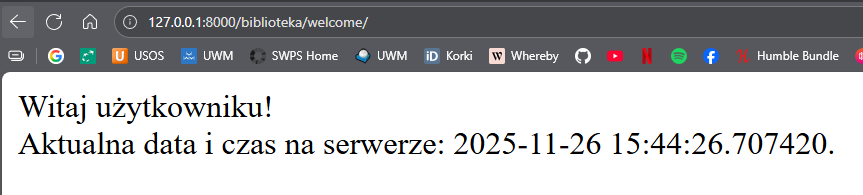

Teraz jak wiemy już jak wygląda logika tworzenia widoków i ich obsługi możemy wykonać widok, który wykorzysta stworzone wcześniej modele.

**Widoki wykorzystujące dane z bazy poprzez klasy modeli i QuerySet** <br>
*!!Przypomnienie z laba poprzedniego!!*

Na wcześniejszych zajęciach przedstawiona została koncepcja korzystania z klasy `QuerySet`, dzięki której możliwe było wykorzystanie zdefiniowanych klas modeli do tego, aby dane powiązane z tymi modelami w bazie danych można było pobierać, dodawać, modyfikować i usuwać.
Wykorzystamy teraz tę wiedzę w definicji widoków.

Zaczniemy od widoku, który posłuży nam do wyświetlenia listy zapisanych w bazie rekordów odpowiadających naszej klasie modelu `Osoba`.

Dodajemy definicję nowego widoku w pliku `biblioteka\views.py`

_**Listing 5**_
```python
# pominięto inne importy
from .models import Osoba

# pominięto definicję innych widoków

def osoba_list_html(request):
    # pobieramy wszystkie obiekty Osoba z bazy poprzez QuerySet
    osoby = Osoba.objects.all()
    return HttpResponse(osoby)
```

Teraz należy dodać mapowanie adresu URL na nasz widok, przyjmijmy, że będzie to adres `127.0.0.1:8000\biblioteka\osoby`

Plik `biblioteka\urls.py` będzie wyglądał teraz tak:

_**Listing 6**_
```python
urlpatterns = [
    path("welcome/", views.welcome_view),
    path("html/osoby/", views.osoba_list_html, name="osoba-list"),
]
```

Dodajemy tutaj nowy paramater jakoo `nazwę referencyjną` używając argumentu `name`. Dzięki temu w późniejszej pracy będziemy mogli przekierować nasz widok z jednego do drugiego używając funkcji `redirect()`.

Otwieramy przeglądarkę i podajemy adres http://127.0.0.1:8000/biblioteka/osoby a widok, który się nam pokaże nie będzie zbyt atrakcyjny, i może nie taki jak się spodziewaliśmy.

> UWAGA! Z racji pewnej dowolności modyfikacji niektórych własności klas modeli oraz cech dodanych encji modelu Osoba, u każdego widok może się różnić.

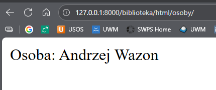

Ten widok wynika z faktu, że po raz kolejny Django (lub bardziej ogólnie wynika to ze specyfiki większości języków programowania zorientowanych obiektowo, w tym Pythona) w momencie przekazywania wartości zmiennej `osoby` pobierze reprezentację każdego z obiektów znajdujących się w tej kolekcji (gdyż to jest instancja obiektu QuerySet) w formie łańcucha znaków, czyli wywoła ich metodę `__str__()`, która w zaprezentowanym przypadku ma postać:

_**Listing 7.1**_
```python
# pozostała część klasy Osoba w pliku models.py została pominięta
    def __str__(self):
        return f"Osoba: {self.imie} {self.nazwisko}"
```

Możemy co prawda zamienić jej postać tak, aby uzyskać trochę lepszy efekt w przypadku naszego widoku np.

_**Listing 7.2**_
```python
    def __str__(self):
        return f"Osoba : {self.imie} {self.nazwisko}, dodana dnia {self.data_dodania}, o stanowisku {self.stanowisko}, płci {self.plec}.\n" 
```

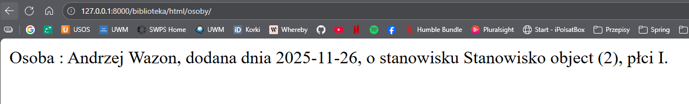

ale to niewiele zmienia w kontekście użyteczności, a na pewno nie nadaje się do tego, aby pobierać dane w sposób uniwersalny umożliwiając później stworzenie różnych szablonów stron, ze stylami i odmiennym wyglądem dla różnych klientów (bytów odbierających dane z naszej aplikacji backendowej).

W tym przypadku również każde wywołanie metody `__str__()` spowoduje zwracanie tego właśnie łańcucha znaków.

Przywrócimy więc funkcję `__str__()` do jej poprzedniej postaci i wykorzystamy dużo lepszy sposób na przekazywanie obiektów do wizualizacji na stronach naszej aplikacji.

### 2. Szablony stron w Django.

Framework Django dostarcza mechanizmu szablonów, dzięki któremu tworzenie modułowych stron opartych o HTML i CSS jest dużo prostsze niż tworzenie ich oddzielnie dla każdego z widoków w aplikacji. Wyobraź to sobie jako szablon, który definiuje różne obszary na naszej stronie np. nagłówek, gdzie znajduje się logo, może nawigacja. Poniżej możemy mieć dodatkowe obszary np. w układzie kolumnowym albo kafelki. Odwiedzając kolejne podstrony cała strona zazwyczaj nie zmienia się diametralnie, ale jest podmieniana tylko treść w niektórych obszarach. To znacznie ułatwia zarządzanie samym szablonem, gdyż zmniejsza ilość pracy w celu zmiany głównego szablonu dla całego serwisu, ale również ułatwia definicję kolejnych widoków i treści, która ma zostać podmieniona tylko w wybranych obszarach szablonu.

Cały proces od przygotowania szablonu (-ów) do finalnego wyświetlenia jednego z widoków w ramach tego szablonu będzie wymagał sporo pracy, więc zostanie opisany w kolejnych krokach.

**Krok 1 - Przygotowanie odpowiedniej struktury folderów i plików w projekcie.**

Najpierw przygotujemy strukturę katalogów oraz kilka pustych plików HTML, w których umieścimy szablon oraz póki co dwie podstrony. Struktur została zaprezentowana poniżej.

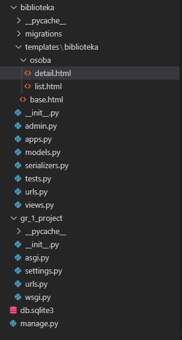

Visual Studio Code "zwija" domyślnie foldery w widoku EXPLORER, które nie zawierają żadnego pliku, stąd widać `templates\biblioteka` w jednej linii, ale foldery te są zagnieżdżone.

Inne przedstawienie struktury

```console

gr_X_project
    - biblioteka
        - templates
            - biblioteka
                - osoba
                    - detail.html
                    - list.html 
                - base.html
```

**Krok 2 - stworzenie szablonu bazowego.**

W pliku `base.html` umieszczamy poniższą zawartość.

_**Listing 8**_
```html
<!DOCTYPE html>
<html>
    <head>
        <title></title>
    </head>
    <body>
        <div id="header" >
            Pierwsza aplikacja Django
        </div>
        <hr/>
        <div id="content">
            
            
        </div>
        <div id="sidebar">
            <p>Panel boczny</p>
        </div>
    </body>
</html>
```

Znaczniki `{}`, które znajdują się w treści szablonu są specjalnymi znacznikami silnika szablonów Django i oznaczają:
* `` - znacznik szablonu
* `{{ zmienna }}` - zmienna szablonu
* `{{ zmienna|filtr }}` - filtr zmiennej

W szablonie powyżej zdefiniowane zostały bloki `title` oraz `content`, których zawartość będziemy mogli podmieniać w poszczególnych podwidokach nie zmieniając całej reszty szablonu. Aktualnie nasz szablon nie korzysta z żadnego pliku ze stylami, zajmiemy się tym później.

**Krok 3 - przygotowanie widoku dla listy obiektów Osoba.**

Teraz umieszczamy poniższą treść w pliku `templates\biblioteka\osoba\list.html`.

_**Listing 9**_
```html


Lista obiektów Osoba


Aktualnie w mojej bazie dodane są poniższe obiekty Osoba.

<p>Osoba: {{ osoba.imie }} {{ osoba.nazwisko }}</p>
<p>Płeć: {{ osoba.plec }}</p>
<p>Data dodania: {{ osoba.data_dodania }}</p>
<p>Stanowisko: {{ osoba.stanowisko }}</p>
<hr>


```

Kilka słów wyjaśnień do powyższego pliku.  
Znacznik `` informuje silnik szablonów o tym, że ten plik rozszerza szablon wskazany w ścieżce, tzn. że jeżeli zdefiniujemy w nim znaczniki bloków o tej samej nazwie co w szablonie, zostaną one podmienione na zawartość bloków zdefiniowanych tutaj jeszcze przed wyświetleniem w przeglądarce. Dzięki temu możemy zamieniać w poszczególnych widokach tylko wybrane fragmenty.
> !!!UWAGA!!! W systemie Windows ściężkę definiujemy przez operator `\`, więc nasza ścieżkaa wygląda jako `biblioteka\base.html`. _**ALE**_ jeżeli używasz Linuxa czy MacOS to ścieżka definiowana jest przez operator `/`, zatem należy zmienić ścieżkę na następującą `biblioteka/base.html` i skrupulatnie używać tego rodzaju definicji i operatora w każdym innym miejscu :)

Znacznik `` oznacza uruchomienie pętli `for` przed wyświetleniem szablonu, która oczekuje istnienia w przestrzeni tego szablonu (przekażemy ją w definicji widoku) zmiennej `osoby`, którą można iterować (przechodzić po jej elementach), gdzie przy każdym przejściu pobierany będzie jeden obiekt `osoba` i zapisywany do zmiennej lokalnej `osoba` tej pętli i powtarzane będą kolejne linie, aż do znacznika ``.  
Zmienne takie jak `{{ osoba.imie }}` odwołują się do własności pojedynczego obiektu `osoba` i w szablonie zostaną zamienione na ich postać łańcuchową (w uproszczeniu tekstową, tak jakbyśmy na każdej z nich wywołali funkję `print()`). Wszystko co zdefiniowane w pętli, zostanie wywołane i powielone tyle razy ile obiektów znajdzie się w zmiennej `osoby`.

**Krok 4 - zmiana definicji widoków.**

Teraz musimy zmienić nieco definicję widoków, tak aby korzystały z odpowiednich szablonów, które stworzyliśmy. W pliku `biblioteka\views.py` zmieniamy definicję widoku funkcyjnego `osoba_view` na poniższy.

_**Listing 10**_
```python
# dodajemy brakujący import, chcoiaż w teorii pownien on nadal znajdować sie na górze pliku views.py
from django.shortcuts import render

def osoba_list_html(request):
    # pobieramy wszystkie obiekty Osoba z bazy poprzez QuerySet
    osoby = Osoba.objects.all()

    return render(request,
                  "biblioteka/osoba/list.html",
                  {'osoby': osoby})
```

Odświeżamy widok w przeglądarce (pod warunkiem, że nasz serwer jest nadal uruchomiony) i powinniśmy zobaczyć widok podobny do poniższego.

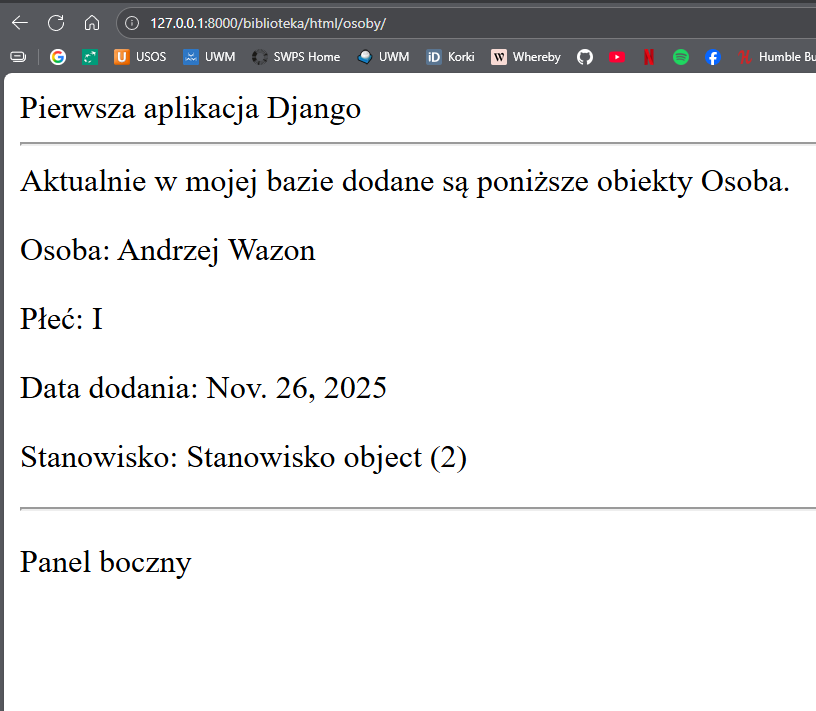

Widok na pewno sam w sobie nie jest imponujący pod względem wizualnym, ale wiemy już jak tworzyć proste szablony i przekazywać do nich dane pobrane z naszej bazy. To daje nam już wiele możliwości rozbudowy aplikacji.

Na koniec dokonamy jeszcze modyfikacji pliku z szablonem, aby możliwe było dodanie styli CSS i zmiana wyglądu strony.

Modyfikacja pliku `base.html` (dodajemy moduł ładowaniak `static` na początku oraz w znaczniku `link` link do naszych CSS'ów):

_**Listing 11**_
```html

<!DOCTYPE html>
<html>
    <head>
        <title></title>
        <link href="" rel="stylesheet">
    </head>
    <body>
        <div id="header" >
            Pierwsza aplikacja Django
        </div>
        <hr/>
        <div id="content">
            
            
        </div>
        <div id="sidebar">
            <p>Panel boczny</p>
        </div>
    </body>
</html>
```

Dodaliśmy mechanizm wczytywania plików statycznych przez Django, które to mogą być plikami ze stylami, obrazami, dołączanymi bibliotekami JavaScript.

Teraz stworzymy jeszcze wymieniony w nagłówku szablonu plik `biblioteka.css`. Obsługa plików statycznych przez Django odbywa się w specyficzny sposób i domyślnie powinny być umieszczane w folderze `static` w każdej aplikacji z osobna. Tworzymy więc folder `static` a w nim folder `css`, w którym umieszczamy plik `biblioteka.css`.

Więc teraz struktura naszych plików powinna wyglądać następująco:

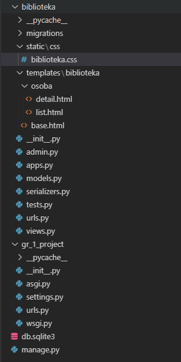

W pliku `biblioteka.css`, może dorzucić następującą treść:

_**Listing 12**_ 
```css
body {
    background-color: lightskyblue;
}
```

Który dokonuje zmiany koloru tła dla całego ciała dokumentu HTML, czyli naszej strony na jasnoniebieski.

Uruchom ponownie serwer i przejdź na widok listy wszystkich obiektów Person i sprawdź w konsoli, gdzie uruchomiony jest serwer czy nie pojawia się błąd 404 protokołu HTTP (NOT FOUND) przy ścieżce do pliku css np. tak 
```console
[28/Nov/2024 21:16:47] "GET /static/css/biblioteka.css HTTP/1.1" 404 1868
```

Może to oznaczać błąd w zdefiniowanej ścieżce.

> ## !!!!UWAGA!!!! 
> Aktualizując pliki .html czy .css czy .js nasz serwer **NIE PRZEŁADUJE SIĘ AUTOMATYCZNIE**!!! Aby załadować zmiany trzeba zmaknąć serwer (*CRTL + C*), a następnie ponownie uruchomić. Serwer przeładowuje się automatycznie tylko rpzy zmianie kodu czyli plików .py.

Teraz przygotujemy widok dla pojedynczego obiektu typu `Osoba`, którego defininicja będzie wymagała przekazywania przez adres URL wartości parametru `id`, dla którego konkretny obiekt `Osoba` zostanie pobrany z bazy danych.

_**Listing 13**_  

Zawartość pliku `template\osoba\detail.html`
```html


{{ osoba.imie }} {{ osoba.nazwisko }}


<p>Osoba: {{ osoba.imie }} {{ osoba.nazwisko }}</p>
<p>Płeć: {{ osoba.plec }}</p>
<p>Data dodania: {{ osoba.data_dodania }}</p>
<p>Stanowisko: {{ osoba.stanowisko }}</p>
<hr>

```

Teraz dodanie widoku w pliku `biblioteka\views.py`

_**Listing 14**_
```python
def osoba_detail_html(request, id):
    # pobieramy konkretny obiekt Osoba
    osoba = Osoba.objects.get(id=id)

    return render(request,
                  "biblioteka/osoba/detail.html",
                  {'osoba': osoba})
```

I dodajemy mapowanie URL na nowy widok w pliku `biblioteka\urls.py`

_**Listing 15**_

```python
from django.urls import path

from . import views

urlpatterns = [
    # cała reszta widoków
    path("welcome/", views.welcome_view),
    path("html/osoby/", views.osoba_list_html, name="osoba-list"),
    path("html/osoby/<int:id>/", views.osoba_detail_html, name="osoba-detail"),
]
```

Definicja `"osoba/<int:id>"` oznacza, że adres pasujący do schematu `.../osoba/liczba_całkowita` będzie mapowany na widok `osoba_detail`. Jest to jeden ze sposobów przekazywania wartości parametrów do naszej aplikacji.

Teraz w przeglądarce po wpisaniu adresu http://127.0.0.1:8000/biblioteka/osoba/1/ powinniśmy zobaczyć widok dla obiektu typu `Osoba` o id=1 o ile istnieje w bazie. Jeżeli obiekt o podanym id nie znajduje się w bazie zgłoszony zostanie wyjątek `models.ModelNotFound`, który nieobsłuzony sposowduje dość brzydki widok na naszej stronie.

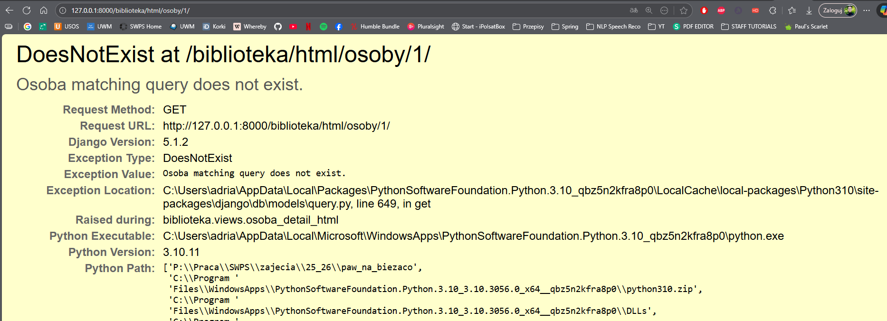

Możemy temu zaradzić dodając obsługę takiej ewentualności. Zmodyfikowana postać widoku `osoba_detail`:
_**Listing 16**_

```python
# dodajemy brakujący import na początku pliku (modyfikacja)
from django.http import Http404, HttpResponse

def osoba_detail_html(request, id):
    # pobieramy konkretny obiekt Osoba
    try:
        osoba = Osoba.objects.get(id=id)
    except Osoba.DoesNotExist:
        raise Http404("Obiekt Osoba o podanym id nie istnieje")

    return render(request,
                  "biblioteka/osoba/detail.html",
                  {'osoba': osoba})
```
A ten sam widok wygląda teraz nieco lepiej.

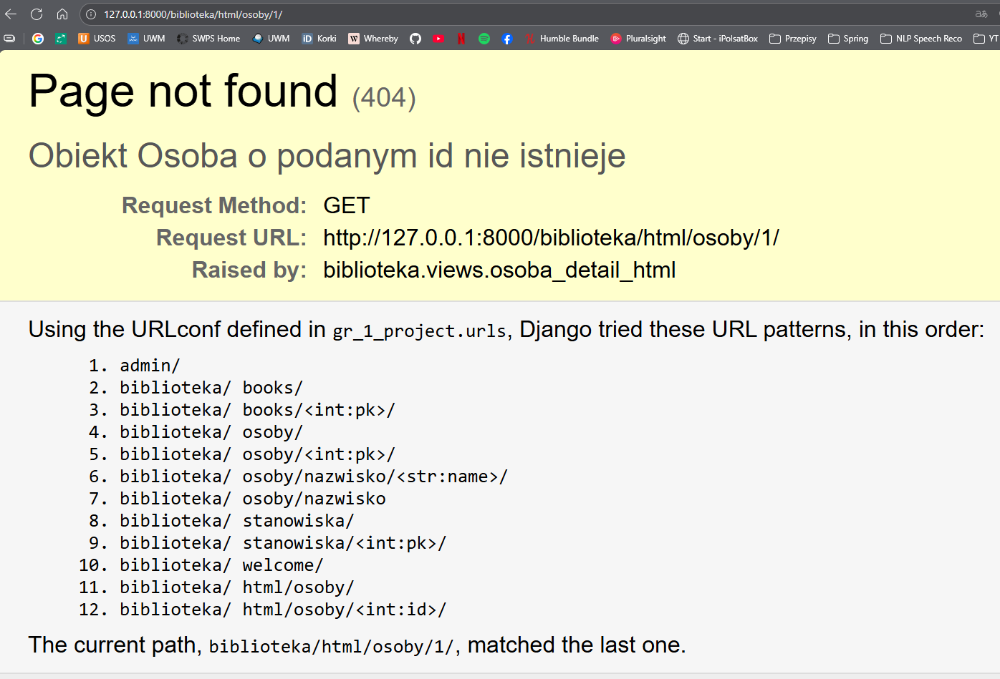

Oczywiście to jedynie proste widoki. Oczywiście chceilibyśmy dodać jakiś widok, który zawierałby jakiś formularz i obsługiwałby również dodawanie obiektów. Spróbujmy zatem dodać taki widok najpier w kodzie. Wykorzystamy do tego znacznik html `form`, który pozwoli nam na wysłanie naszych danych pod dany adres metodą HTTP POST:

_**Listing 17**_

```python
def osoba_create_html(request):
    stanowiska = Stanowisko.objects.all()  # pobieramy listę stanowisk z bazy

    if request.method == "GET":
        return render(request, "biblioteka/osoba/create.html", {'stanowiska': stanowiska})
    elif request.method == "POST":
        imie = request.POST.get('imie')
        nazwisko = request.POST.get('nazwisko')
        plec = request.POST.get('plec')
        stanowisko_id = request.POST.get('stanowisko')

        if imie and nazwisko and plec and stanowisko_id:
            # pobieramy obiekt stanowiska
            try:
                stanowisko_obj = Stanowisko.objects.get(id=stanowisko_id)
            except Stanowisko.DoesNotExist:
                error = "Wybrane stanowisko nie istnieje."
                return render(request, "biblioteka/osoba/create.html", {'error': error, 'stanowiska': stanowiska})

            # tworzymy nową osobę
            Osoba.objects.create(
                imie=imie,
                nazwisko=nazwisko,
                plec=plec,
                stanowisko=stanowisko_obj
            )
            return redirect('osoba-list')
        else:
            error = "Wszystkie pola są wymagane."
            return render(request, "biblioteka/osoba/create.html", {'error': error, 'stanowiska': stanowiska})
```

Następnie dodamy sobie nowy szablon do dowania obiektu `Osoba` jako `create.html` w odpowiednim folderze `templates/biblioteka/osoba/`:

_**Listing 18**_

```html


Dodaj nową osobę


<h1>Dodaj nową osobę</h1>

    
        <p style="color: red;">{{ error }}</p>
    

    <form method="post">
        
        <label for="imie">Imię:</label>
        <input type="text" id="imie" name="imie"><br><br>

        <label for="nazwisko">Nazwisko:</label>
        <input type="text" id="nazwisko" name="nazwisko"><br><br>

        <label for="plec">Płeć:</label>
        <select id="plec" name="plec">
            <option value="1">kobieta</option>
            <option value="2">mężczyzna</option>
            <option value="3">inna</option>
        </select><br><br>

        <label for="stanowisko">Stanowisko:</label>
        <select id="stanowisko" name="stanowisko">
            
                <option value="{{ s.id }}">{{ s.nazwa }}</option>
            
        </select><br><br>

        <button type="submit">Zapisz</button>
    </form>

```

No i terazz oczywiście dodamy ten widok do naszych linków `urls.py`:

_**Listing 19**_

```python
from django.urls import path

from . import views

urlpatterns = [
    # cała reszta widoków
    path("welcome/", views.welcome_view),
    path("html/osoby/", views.osoba_list_html, name="osoba-list"),
    path("html/osoby/<int:id>/", views.osoba_detail_html, name="osoba-detail"),
    path("html/osoby/dodaj/", views.osoba_create_html, name="osoba-create"),
]
```

Powinien on wyglądać podobnie jak poniżej:

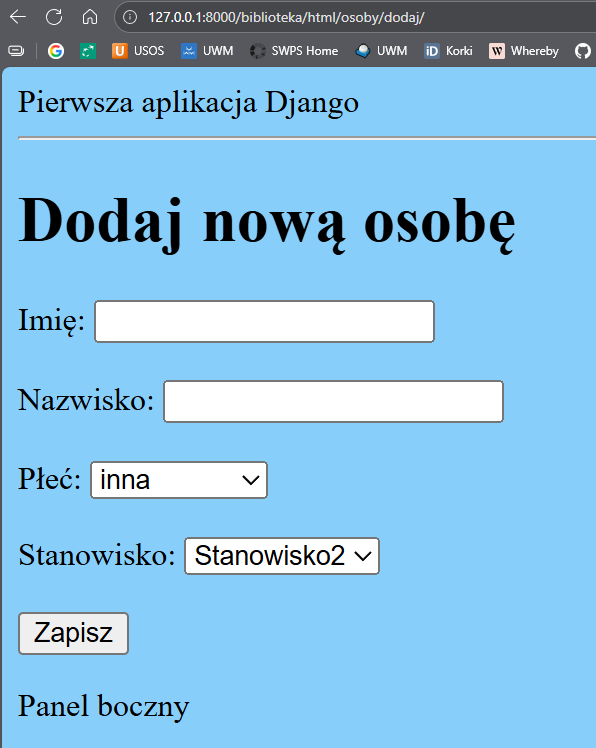

> ## !!!UWAGA!!! Wypadałoby by jeszcze dodać walidację w tym miejscu w naszej funkcji, kiedy pobieramy dane z formularza, gdyż warto zauważyć, że nie używamy tutaj _**Serializatorów**_ naszych modeli.

Ten sam widok możemy użyć do aktualizowania naszego obiektu adekwatnie zmieniając metodę w formularzu z `POST` na `PUT` oraz wczytając w domyślną już posiadaną wartość zancznika `<input>` wartości pobranego obiektu `Osoba`.

Aby dopełnić naszego **CRUD**'a możemy dodać do widoków obsługę metody `DELETE` modyfikując już gotowy nasz widok szczegółów. Problem w naszym widoku jest taki, że HTML nie obsługuje metody `DELETE` w formularzach. Przeglądarka może wysyłać tylko `GET` i `POST`. Dlatego w praktyce usuwanie w Django realizuje się przez `POST`, a nie `DELETE`:

_**Listing 20**_
```python
def osoba_detail_html(request, id):
    # pobieramy konkretny obiekt Osoba
    try:
        osoba = Osoba.objects.get(id=id)
    except Osoba.DoesNotExist:
        raise Http404("Obiekt Osoba o podanym id nie istnieje")

    if request.method == "GET":
        return render(request,
                    "biblioteka/osoba/detail.html",
                    {'osoba': osoba})
    if request.method == "POST":
        osoba.delete()
        return redirect('osoba-list') 
```

Teraz zmodyfikujmy sam szablon `osoba_detail.html`, aby dodać przycisk usunięcia:

_**Listing 21**_
```html


{{ osoba.imie }} {{ osoba.nazwisko }}


<p>Osoba: {{ osoba.imie }} {{ osoba.nazwisko }}</p>
<p>Płeć: {{ osoba.plec }}</p>
<p>Data dodania: {{ osoba.data_dodania }}</p>
<p>Stanowisko: {{ osoba.stanowisko }}</p>
<form method="post">
    
    <button type="submit" onclick="return confirm('Czy na pewno chcesz usunąć tę osobę?');">
        Usuń osobę
    </button>
</form>
<hr>

```

`` to znacznik szablonu Django, który wstawia do formularza unikalny token CSRF.

`CSRF` to skrót od **Cross-Site Request Forgery**, czyli „fałszerstwo żądań między stronami”. Jest to rodzaj ataku, w którym złośliwa strona wysyła żądanie do Twojej aplikacji w imieniu zalogowanego użytkownika, np. aby usunąć dane, zmienić hasło itp.

Django chroni przed tym automatycznie:
* Każdy formularz POST powinien zawierać token CSRF, który jest losowy i unikalny dla sesji użytkownika.
* Gdy formularz zostanie wysłany, Django sprawdza, czy token w formularzu zgadza się z tym w sesji.
* Jeśli token się nie zgadza lub go brakuje, Django blokuje żądanie i zwraca błąd 403.

Teraz nasz widok szczegółowy powinien zawierać przycisk:

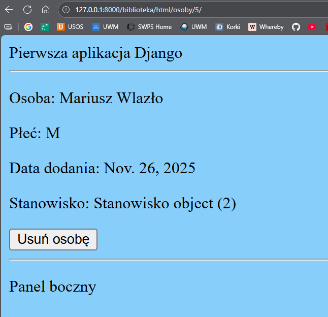

A po jego naciśnieciu wyskoczy komunikat, którego potwierdzenie będzie skutkować usunięciem obiektu:

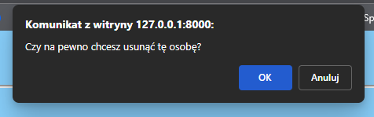

### DLA ZAAWANSOWANYCH

## Django Forms

`Django Forms` to moduł w Django, który umożliwia tworzenie, wyświetlanie i obsługę formularzy HTML w Pythonie, wraz z automatyczną walidacją danych i integracją z modelami bazy danych (przez ModelForm).

Możemy taki sam efekt jak ręcznie napisany formularz HTML uzyskać automatycznie za pomocą `Django Form`, które automatycznie stworzą nam reaktywny formularz na bazie naszej klasy. Aby to zrobić w folderze naszej aplikacji `biblioteka` musimy utworzyć najpierw plik `forms.py`, wktórym zawierać się będa taki formularze:

_**Listing 22**_

```python
from django import forms
from .models import Osoba

# przykładowy formularz dla modelu Osoba
class OsobaForm(forms.ModelForm):
    class Meta:
        model = Osoba
        fields = ['imie', 'nazwisko', 'plec', 'stanowisko']  # pola do formularza
```

Następnie możemy dodać nowy widok do dodawania obiektu `Osoba` z użyciem Django Forms lekko zmodyfikowany względem poprzedniego:

_**Listing 23**_

```python
from django.shortcuts import redirect
from .forms import OsobaForm

def osoba_create_django_form(request):
    if request.method == "POST":
        form = OsobaForm(request.POST)
        if form.is_valid():
            form.save()
            return redirect('osoba-list')  
    else:
        form = OsobaForm()

    return render(request,
                  "biblioteka/osoba/create_django.html",
                  {'form': form})
```

Warto zwrócić tutaj na przekazanie formularza jako zmiennej `form` do naszego szablonu `create_django.html`, którą to zmienną następnie obsłużymy wyświetlając ten formularz w formie prostej metodą `.as_p`.

Musimy teraz stworzyć formularz gdzie wstrzykniemy gotowy formularz dla modelu `Osoba` jako szablon `create_django.html` oczywiście w folderze `templates/biblioteka/osoba`:

_**Listing 24**_
```html


Dodaj nową osobę


<h1>Dodaj nową osobę</h1>

<form method="post">
    
    {{ form.as_p }}
    <button type="submit">Zapisz</button>
</form>
<hr>

```

A następnie musimy dodać ten widok do naszych linków:

_**Listing 25**_
```python
from django.urls import path

from . import views

urlpatterns = [
    # cała reszta widoków
    path("welcome/", views.welcome_view),
    path("html/osoby/", views.osoba_list_html, name="osoba-list"),
    path("html/osoby/<int:id>/", views.osoba_detail_html, name="osoba-detail"),
    path("html/osoby/dodaj/", views.osoba_create_html, name="osoba-create"),
    path("html/osoby/dodaj_django/", views.osoba_create_django_form, name="osoba-create-django"),
]
```

Powinien on wyglądać podobnie jak poniżej:

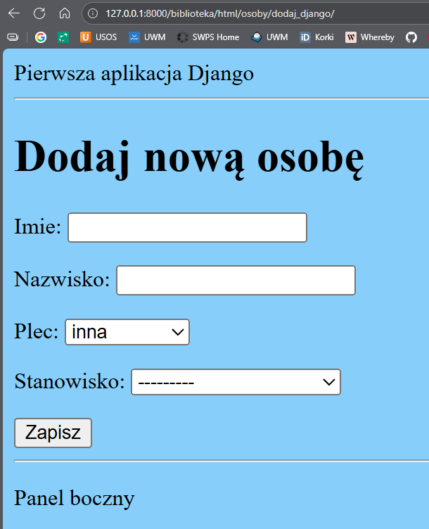


# **Ćwiczenia do samodzielnego wykonania**

**Zadanie 1**

Stwórz w ten sam sposób widoki dla reszty widoków czyli:
* wyświetlanie listy obiektów typu:
    * `Book`,
    * `Stanowisko`,
* wyświetlanie szczegółów obiektu typu
    * `Book`,
    * `Stanowisko`,

**Zadanie 2**

Spróbuj dodać widok, który pozwoli dodawać obiekty typu `Book` oraz `Stanowisko`.

**Zadanie 3**

Spróbuj dodać widok, który wyświetli listę obiektów typu `Osoba`, które zawierają w polu `nazwa` zadany łańcuch znaków bazując na już stworzonym widoku REST API.

**Zadanie 4**

Dodaj możliwość usuwania obiektów typu `Book` oraz `Stanowisko`.

**Zadanie 5 (TRUDNIEJSZE)**

Czy jesteś w stanie stworzyć widok do edycji obiektów typu `Osoba`, `Book` oraz `Stanowisko`? 

**Zadanie 6 (opcjonalne, dla chętnych)**

Dodatkowo w pliku `biblioteka.css` bazując na wykładzie i swoich doświadczeniach zdefiniuj style, które nadadzą stronie trochę inny (milszy czy lepszy :) ) widok.
